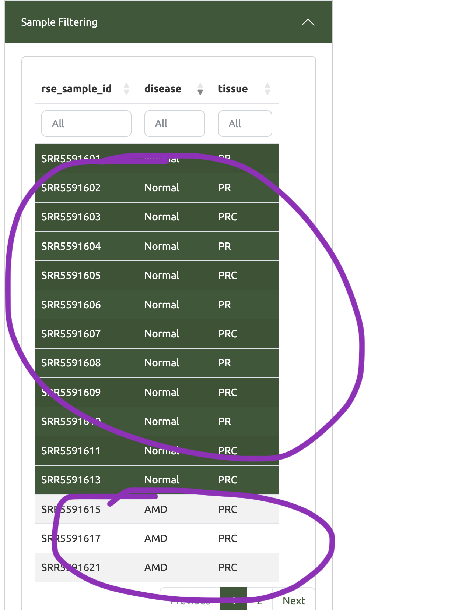
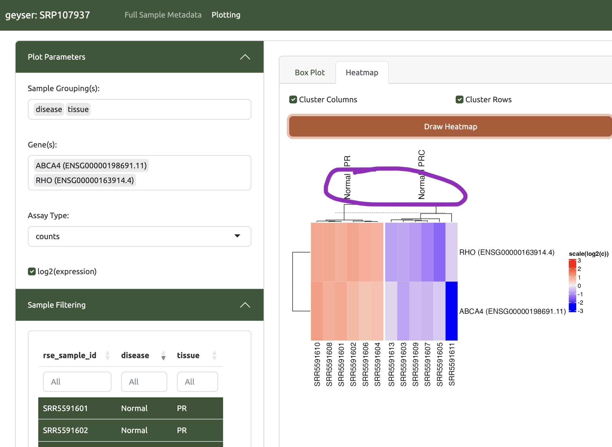

```{r, include = FALSE}
knitr::opts_chunk$set(
  collapse = TRUE,
  comment = "#>"
)
```

# Install
```{r install}

```

# Load Test Data
```{r setup}
library(geyser)
load(system.file('extdata/tiny_rse.Rdata', package = 'geyser'))
```

# Run
Running geyser is as simple as giving the the [SummarizedExperiment](https://bioconductor.org/packages/release/bioc/html/SummarizedExperiment.html) object to the `geyser` function.
```{r faux_run}
if (interactive()){
  geyser(tiny_rse)
}
```

# Screenshots of some core views

The Shiny-based GUI first shows you the metadata (`colData` slot) of the SummarizedExperiment (SE) object.

The idea is that this helps you ID which are the relevant fields to plot against.

<p align="center">

</p>

You can then head to the Plotting section and start typing in those fields (tissue and disease)

<p align="center">

</p>

After that you can type in the genes you are interested in.

<p align="center">

</p>

When you click the orange "Draw Box Plot" button the plot will be made

<p align="center">

</p>

You can *custom filter* which samples are shown by clicking on the "Up arrow"
next to "Sample Filtering" and then selecting the samples you want to display. 
Here we select only the normal samples and then use the Heatmap visualization.

<p align="center">

</p>

<p align="center">

</p>

If you want to reset the custom sample filtering, just click the "Clear Rows" button

<p align="center">

</p>


# How to use [recount3](https://rna.recount.bio) to quickly grab a pre-processed dataset

We also do some light tweaking of the metadata to make human useable splits
```{r}
# If needed: BiocManager::install("recount3")
if (interactive()){
  library(recount3)
  library(geyser)
  human_projects <- available_projects()
  proj_info <- subset( 
    human_projects,
    project == "SRP107937" & project_type == "data_sources" 
  )
  rse_SRP107937 <- create_rse(proj_info)
  assay(rse_SRP107937, "counts") <- transform_counts(rse_SRP107937)
  # first tweak that glues the gene name onto the gene id in the row names
  rownames(rse_SRP107937) <- paste0(rowData(rse_SRP107937)$gene_name, ' (', row.names(rse_SRP107937), ')')
  # creates two new metadata fields 
  colData(rse_SRP107937)$tissue <- colData(rse_SRP107937)$sra.sample_title %>% stringr::str_extract(.,'PRC|PR')
  colData(rse_SRP107937)$disease <- colData(rse_SRP107937)$sra.sample_title %>% stringr::str_extract(.,'AMD|Normal')
  
  geyser(rse_SRP107937, " geyser: SRP107937")
}
```

# Session Info
```{r}
sessionInfo()
```
